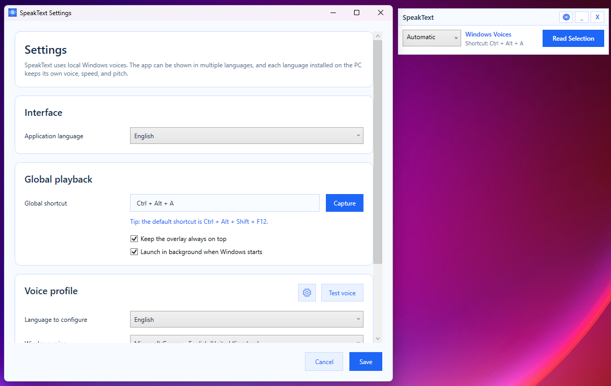
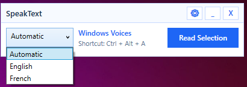

# SpeakText

SpeakText is a compact Windows overlay that reads the currently selected text aloud from almost any application.

## Features

- Reads the current text selection through a global shortcut or the overlay button.
- Uses local Windows voices only, with no cloud TTS dependency.
- Includes a compact overlay with quick access to playback, language selection, settings, minimize, and close actions.
- Stays available from the Windows notification area after minimizing.
- Supports automatic language detection, including mixed-language selections.
- Lets you configure a dedicated voice profile for each installed language.
- Lets you adjust voice speed and pitch per language.
- Lets you preview each configured voice before saving it.
- Lets you change the application interface language.
- Supports a custom global shortcut.
- Supports always-on-top mode.
- Can launch in the background when Windows starts.

## Screenshots

### Settings Window

The settings window lets users configure the interface language, the global shortcut, startup behavior, always-on-top mode, and per-language voice profiles.



### Language Selection And Automatic Mode

The overlay lets users choose a specific language manually or switch to automatic mode so SpeakText can pick the most suitable voice profile for the selected text.



## Download The Compiled App

Download the latest prebuilt package from the repository's **Releases** page when a release is available.

If there is no release yet, open the latest successful run in the **Actions** tab and download the `SpeakText-win-x64` artifact produced by the build workflow.

The repository contains both the source code and the instructions needed to rebuild the application, while the compiled package is distributed through GitHub Releases or Actions artifacts to keep the repository easier to browse and maintain.

The compiled package does not require the .NET 8 SDK. The SDK is only needed if you want to build, inspect, or modify the project from source.

## Source Code

The main project file now lives at the repository root as `SpeakText.csproj`. The source files remain under `src\SpeakText.App`.

## Requirements

### To Use A Compiled Release

- Windows 10 or Windows 11
- No .NET SDK is required
- No separate .NET runtime is required for the self-contained package produced by the included GitHub workflows

### To Build From Source

- Windows
- .NET 8 SDK

## Default Behavior

- Default shortcut: `Ctrl + Alt + Shift + F12`
- Default interface language: uses the system language when SpeakText supports it, otherwise English
- Speech engine: Windows Voices

## Build From Source

```powershell
dotnet restore .\SpeakText.csproj --configfile .\NuGet.Config
dotnet build .\SpeakText.csproj -c Release --no-restore --configfile .\NuGet.Config
```

## Run From Source

```powershell
dotnet run --project .\SpeakText.csproj --configfile .\NuGet.Config
```

## Publish A Standalone Build

The following command creates a self-contained Windows x64 build suitable for GitHub Releases:

```powershell
dotnet publish .\SpeakText.csproj `
  -c Release `
  -r win-x64 `
  --self-contained true `
  -o .\SpeakText-win-x64 `
  --configfile .\NuGet.Config
```

For a local build on your PC, the published application will be created in `.\SpeakText-win-x64`.

The GitHub build workflow also publishes a compiled `SpeakText-win-x64` package as a downloadable artifact.

## Notes

- SpeakText captures the active selection by temporarily sending `Ctrl+C`, reading the clipboard text, then restoring the previous clipboard contents.
- Visible Windows voices are filtered by language and obvious duplicates are hidden.
- `x1.00` matches the native speed of the selected Windows voice. The available range in the application is `x0.35` to `x3.00`.
- The application is currently Windows-only.

## License

This project is released under the MIT License. See [LICENSE](./LICENSE).
